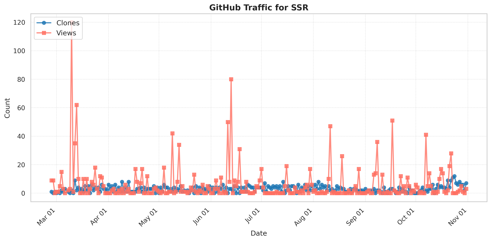

# SSR: Spatial Sequential Hybrid Architecture for Latency Throughput Tradeoff in Transformer Acceleration (FPGA'24)  Jinming Zhuang, Zhuoping Yang, Shixin Ji, Heng Huang, Alex K. Jones, Jingtong Hu, Yiyu Shi, Peipei Zhou

# Team
Principal Investigator: Prof. Peipei Zhou, https://peipeizhou-eecs.github.io/

Ph.D. Students: Jinming Zhuang (Student Lead), Zhuoping Yang, and Shixin Ji

Faculty Collaborators: Professors Heng Huang (Maryland), Alex Jones (Syracuse), Jingtong Hu (Pitt), and Yiyu Shi (Notre Dame)

## 🚀 Thank You for Using SSR! ! !
### Your support and growing engagement inspire us to continually improve and enhance the project.
+ Total Views since 02/26/2025: <!--VIEWS-->1193<!--/VIEWS-->
+ Total Downloads since 02/26/2025: <!--CLONES-->607<!--/CLONES-->

## ACM/IEEE Reference Format
1. Jinming Zhuang, Zhuoping Yang, Shixin Ji, Heng Huang, Alex K. Jones, Jingtong Hu, Yiyu Shi, and Peipei Zhou. 2024. SSR: Spatial Sequential Hybrid Architecture for Latency Throughput Tradeoff in Transformer Acceleration. In Proceedings of the 2024 ACM/SIGDA International Symposium on Field Programmable Gate Arrays (FPGA '24). Association for Computing Machinery, New York, NY, USA, 55–66. https://doi.org/10.1145/3626202.3637569
